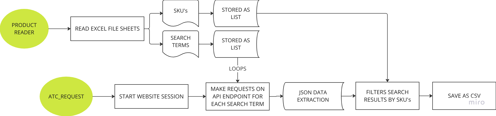
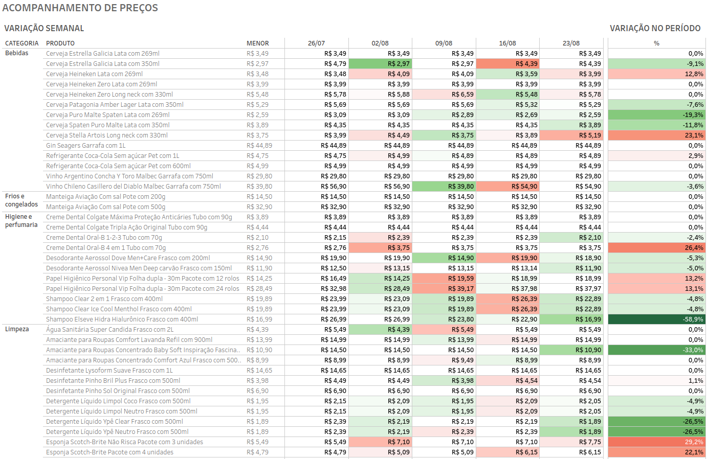

# PERSONAL CPI INDEX - A WEBSCRAPPING PROJECT

## DESCRIPTION
This project is a simple ETL python based to webscrapping a list of products and their brands that I buy from a local retailer on weekly basis. The intent is to track how the pricing changes week over week and spot some opportunities for grocery.

In developing this project, I've tried to apply a series of best practices, including:

- OOP
- Logging
- Testing
- CI/CD
- Docker & Airflow for schedulling

It is expected that weekly files will be generated, which will be loaded into my local data warehouse and later analyzed with Tableau.

## EXECUTION DESCRIPTION

1. **product_reader.py**    
This script contains the class that reads and stores the data of search terms and SKUs of the products I usually consume. These were previously scraped on another occasion to form an initial filtering base for the queries in an Excel file;

2. **atc_requests.py**  
This script contains the class that generates requests to the product search API on the website, and extracts the data from the JSON. The data is filtered based on desired SKUs and saved as a CSV file;

3. **main.py**  
Executes the application;

## WORKFLOW

## DATA RESULTS

The workbook can be seen here:
https://public.tableau.com/app/profile/lcsprado/viz/PRODUCTLISTPPRICETRACKING/Painel1

